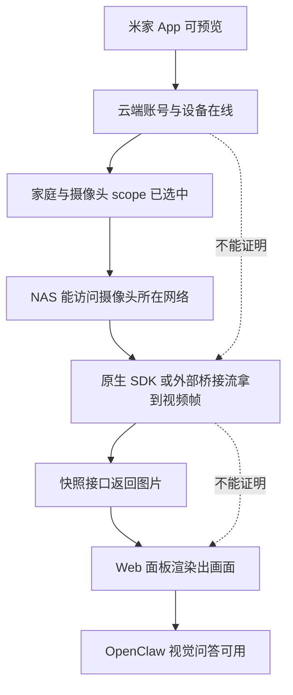

# 摄像头面板画面修复与验收方法论

本文用于处理“米家 App 能看画面，但 Miloco 面板没有画面 / 显示 0 个在感知”的问题。

核心原则：不要把“服务启动”“接口返回成功”或“米家 App 能预览”当作修复完成。摄像头问题必须分层验证，最后一层一定要看到 Miloco 面板真实渲染出画面。

相关案例：

- [NAS 上小米摄像头底层通道不吐帧，改用外部桥接流并修复面板假空态](cases/nas-xiaomi-external-stream-panel-fix.md)

相关方法论来源：

- 摄像头状态分层：[../../fix-camera/cameras.md](../../fix-camera/cameras.md)
- 摄像头六层排障：[../../fix-camera/camera-runbook.md](../../fix-camera/camera-runbook.md)
- denylist 误拦截修复：[../../fix-camera/camera-denylist-auto-fix-guide.md](../../fix-camera/camera-denylist-auto-fix-guide.md)
- 低配 NAS 性能与快照预览经验：[../../nas/low-config-performance-current-status.md](../../nas/low-config-performance-current-status.md)
- 研发故障排查入口：[../../../knowledge/06-dev-guide/troubleshooting.md](../../../knowledge/06-dev-guide/troubleshooting.md)

## 适用场景

| 场景 | 是否适用 |
| --- | --- |
| 米家 App 能预览，但 Miloco 面板显示没有摄像头在感知 | 是 |
| 摄像头开关已打开，但面板仍显示 0 个在感知 | 是 |
| 后端 `connected=true`，但面板仍没有画面 | 是 |
| OpenClaw 能描述画面，但 Miloco 首页小窗为空 | 是 |
| 纯安装失败、服务无法启动 | 否，先走部署排障 |

## 分层模型

术语说明：

- NAS：网络存储服务器，也就是家里的小服务器。
- SDK：软件开发工具包，可以理解成别人提供的一套摄像头连接工具。
- go2rtc：视频流转接服务，作用是把摄像头私有视频通道转成 Miloco 更容易消费的视频流。
- RTSP：摄像头常用视频流协议，可以理解成“视频水管地址”。
- JPEG：常见照片图片格式，适合作为面板轻量预览。
- Web 面板：浏览器里打开的 Miloco 页面。
- DOM：网页结构树，可以理解成浏览器眼里的页面零件清单。
- CPU：处理器，负责做计算；摄像头解码、识别和转码都会消耗它。
- token：访问令牌，像一把临时钥匙，公开文档里不能保存真实值。
- DID：设备编号，用来区分不同摄像头，公开文档里不能保存完整真实值。
- `connected=true`：后端已经拿到摄像头视频帧。
- `in_use=true`：用户允许 Miloco 使用这台摄像头。
- `camera_id`：接口里用来指定哪台摄像头的参数。
- scope：使用范围，可以理解成“Miloco 被允许看哪些家庭、哪些摄像头”。
- keyframe：关键帧，视频里能独立解出来的一张完整画面。
- iframe：网页里嵌入另一个页面的小窗。
- BGR：图片在程序里的彩色像素格式，常见于 OpenCV（图像处理工具）。
- naturalWidth：浏览器记录的图片真实宽度，大于 0 说明图片确实加载出来。
- direct SDK probe：直接探测底层摄像头工具，绕过网页和普通开关，看它到底有没有吐视频帧。
- raw/JPEG/frame：三种“有没有画面数据”的计数；raw 是原始视频包，JPEG 是图片，frame 是解码后的画面。
- host 网络：容器直接使用宿主机网络，像程序跑在 NAS 本机上一样，更容易收到摄像头视频流。
- LAN override：手动指定摄像头局域网地址，用来修复自动发现不到 IP 的情况。

## 相关方法论地图

| 方法论 | 解决的问题 | 关键动作 | 本文如何吸收 |
| --- | --- | --- | --- |
| 状态分层法 | “在线/离线”一个词太粗，容易误判 | 拆成云端在线、局域网在线、流连接、Agent 可用 | 本文增加“前端渲染”层，避免 `connected=true` 后提前收工 |
| 六层排障法 | 摄像头问题容易直接重装或乱改 | 按账号、设备、scope、局域网、流连接、OpenClaw 排查 | 本文把“面板真实画面”放到流连接之后、OpenClaw 之前 |
| 字段组合法 | “已开启但 0 个在感知”原因不止一种 | 联合看 `in_use`、`connected`、`stream_state`、快照 | 本文要求页面也展示连接中或失败原因，不再只有空态 |
| direct SDK probe 法 | 判断是不是原生 SDK 不吐帧 | 绕过 UI 和 scope，直接看 raw/JPEG/frame 计数 | 本文把它作为“米家 App 能看但 Miloco 没帧”的分水岭 |
| denylist 修复法 | 机型被误拦截导致不能启用 | 只有 probe 出帧后才移出 denylist | 本文禁止用改 UI 或伪造 `connected=true` 代替真实帧 |
| 外部桥接流法 | 原生 SDK 长期不吐帧 | 用 go2rtc / RTSP 先产出可消费视频流 | 本文把桥接流纳入验收链路，仍要求面板显示真实画面 |
| 低配快照预览法 | 首页直播小窗给 NAS 增加负载 | 首页和录入取景器优先用 JPEG 快照 | 本文把快照作为面板视觉验收的默认低负载路径 |
| 浏览器视觉验收法 | 后端成功但用户页面仍空 | 用截图、DOM、图片尺寸确认真实渲染 | 本文把它定为最终验收，而不是可选检查 |

## 固定排查顺序

| 层级 | 要确认什么 | 典型证据 | 不足以证明什么 |
| --- | --- | --- | --- |
| 米家侧 | 摄像头在米家 App 里能看 | 手机 App 可预览 | 不能证明 NAS 上的 Miloco 能拿到帧 |
| 账号与 scope | Miloco 已绑定账号，且目标家庭/摄像头在使用范围内 | 账号状态、设备列表、摄像头 scope | 不能证明视频通道已经通 |
| 网络侧 | NAS 与摄像头网络可达 | 摄像头局域网地址、同网段、容器网络模式 | 不能证明底层 SDK 已吐帧 |
| 视频通道侧 | 原生 SDK 或外部桥接流能产出帧 | raw/JPEG/frame 计数、go2rtc 生产者 | 不能证明 Miloco 已消费 |
| 后端侧 | Miloco 已收到可解码视频帧 | `connected=true`、转接服务有消费者、快照接口 200 | 不能证明浏览器已经显示 |
| 接口侧 | 快照接口能返回真实图片 | `/api/miot/snapshot` 返回 `image/jpeg` | 不能证明页面状态没有卡住 |
| 前端侧 | 面板已渲染图片 | 截图里有画面、图片 `naturalWidth` 大于 0 | 这才接近用户验收 |
| Agent 侧 | OpenClaw 可用画面回答 | 视觉问答描述真实画面 | 不能替代 Miloco 面板验收 |

## 症状路由表

| 用户看到的现象 | 不要先做什么 | 正确下一步 |
| --- | --- | --- |
| 米家 App 能看，Miloco 没画面 | 不要直接宣布摄像头正常 | 查 scope、`lan_online`、`connected`、快照和短录制 |
| 摄像头开关已开，但首页 0 个在感知 | 不要反复让用户开关 | 联合看 `in_use=true`、`connected=false`、`stream_state` 和页面轮询 |
| `connected=true`，但首页仍空 | 不要只重启后端 | 查快照接口、前端静态资源、图片加载和浏览器缓存 |
| 首页有快照，身份录入黑屏 | 不要改摄像头链路 | 让身份录入取景器走同一快照路径，避免直播 iframe |
| Web 面板有画面，OpenClaw 看不到 | 不要改面板 | 查 `active_sources`、视觉模型配置和插件状态 |
| 名称显示“当前机型暂不支持感知” | 不要直接改 UI 文案 | 先做 direct SDK probe；出帧才允许修 denylist |
| 原生 SDK 一直 raw/JPEG/frame 都是 0 | 不要继续堆 LAN override | 转外部桥接流，或换已验证可出帧摄像头 |
| 低配 NAS 页面卡首帧 | 不要把首页改成常驻直播 | 用 JPEG 快照兜底，降低转码和解码压力 |

## 关键判断

### 米家 App 能看不等于 Miloco 能看

米家 App 可能走云端或手机侧通道；Miloco 在 NAS 上运行，需要本地进程通过 SDK 或外部桥接流拿到可解码帧。因此用户说“米家 App 可以看”时，只能作为摄像头本身没坏的证据，不能作为 Miloco 已修复的证据。

### `connected=true` 仍不等于面板有画面

`connected=true` 只说明后端已经拿到帧。首页可能仍然因为状态轮询、图片加载、浏览器缓存、直播解码能力或前端展示条件而卡在空态。必须继续检查快照接口和页面渲染。

### 面板预览优先用快照兜底

低配 NAS 上不要为了首页小窗常驻直播转码。首页卡片和身份录入取景器优先使用最近感知帧生成的 JPEG 快照：

- 小窗用较小宽度，降低 CPU 压力。
- 放大态可以用更高宽度，但仍是快照。
- 真直播只作为明确需要时的高级能力。

## 修复策略

| 根因 | 修复方向 |
| --- | --- |
| 容器网络隔离导致收不到视频帧 | 恢复 host 网络或确保视频通道能进容器 |
| 摄像头不在启用 scope 中 | 先切家庭或启用目标摄像头，不要改视频层 |
| denylist 误拦截 | direct SDK probe 证明出帧后再移除拦截 |
| 原生 SDK 不吐帧 | 用 go2rtc / RTSP 网关提供外部桥接流 |
| 桥接流可用但 Miloco 没消费 | 配置 `camera.external_streams` 并重启后端 |
| 后端有帧但面板空态 | 前端展示逻辑不要只依赖单一状态字段，已开启在线摄像头应先显示卡片并拉快照 |
| 快照接口失败 | 查感知缓冲、鉴权 token、目标 `camera_id` 和最近帧缓存 |
| 浏览器仍旧页面 | 强制刷新并确认新静态资源文件名 |

## 证据阶梯

排障报告必须说明自己停在哪一级，不要把低级证据包装成高级验收。

| 等级 | 证据 | 结论力度 |
| --- | --- | --- |
| L0 | 米家 App 能看 | 摄像头和账号大概率没坏 |
| L1 | Miloco 能列出设备和摄像头 | 账号、家庭和设备同步基本可用 |
| L2 | `in_use=true` | 用户允许 Miloco 使用这台摄像头 |
| L3 | `connected=true` 或桥接流有消费者 | 后端可能已经拿到视频帧 |
| L4 | `/api/miot/snapshot` 返回有效 JPEG | 后端已有可展示画面 |
| L5 | 页面显示 `1 个在感知` 且图片尺寸大于 0 | Web 面板状态和图片加载正确 |
| L6 | 浏览器截图里有真实画面 | 用户侧视觉验收通过 |
| L7 | OpenClaw 能基于画面回答 | Agent 视觉链路通过 |

本文的最低交付等级是 L6；如果任务还包含 OpenClaw 视觉能力，才要求 L7。

## 验收清单

交付前至少同时满足：

| 验收项 | 合格标准 |
| --- | --- |
| 后端健康 | `/health` 返回 ok |
| 摄像头作用域 | 目标摄像头 `in_use=true` |
| 视频帧 | 目标摄像头 `connected=true` |
| 快照接口 | `/api/miot/snapshot` 返回 `image/jpeg` 且图片尺寸大于 0 |
| 面板文本 | 首页显示 `1 个在感知` 或对应数量 |
| 面板画面 | 浏览器截图中能看到摄像头真实画面，不再是空态 |
| 低配约束 | 保持 LOW 画质或低负载配置，不因验证临时切高后忘记恢复 |
| 清理 | 临时浏览器、上传包、调试脚本、临时目录已删除 |

## 常见错误

| 错误做法 | 为什么错 |
| --- | --- |
| 只看米家 App 正常就说修好了 | 那不是 Miloco 的视频通道 |
| 只看 `/health` 正常就说修好了 | 服务活着不等于摄像头有帧 |
| 只看 `connected=true` 就说面板好了 | 后端有帧不等于前端已显示 |
| 反复让用户开关摄像头 | 如果底层不吐帧，反复开关只会增加负载 |
| 低配 NAS 上常驻直播预览 | 容易带来额外转码和解码压力 |
| 不清理临时浏览器和上传包 | 会占用用户内存或硬盘 |

## 与案例的关系

本方法来自一次真实 NAS 修复。案例只保留可复用路径与证据类型，不保存 token、完整设备 ID、私密日志或用户截图原件。具体见：

- [NAS 上小米摄像头底层通道不吐帧，改用外部桥接流并修复面板假空态](cases/nas-xiaomi-external-stream-panel-fix.md)
