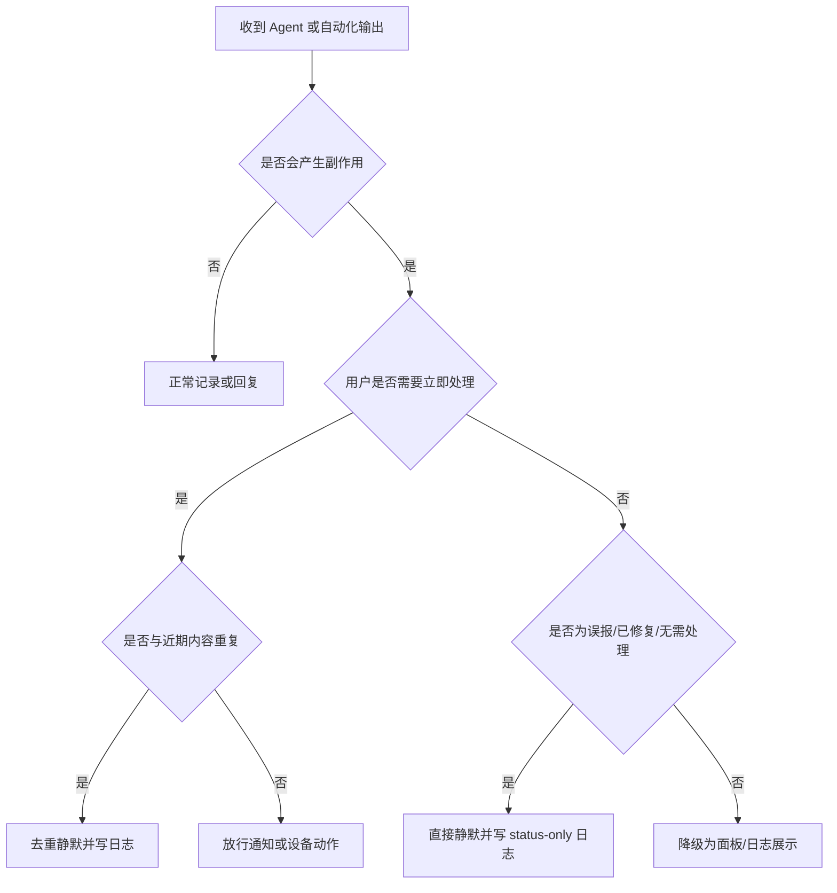

# 通知类副作用保护方法论

本文用于处理 Miloco / OpenClaw 自动化链路中的通知刷屏、音箱误播报、重复控制等问题。

核心原则：先判断这条输出是否真的需要打扰用户，再决定是否允许它走手机推送、IM、音箱 TTS 或设备动作。不要只在 Agent 提示词里约束，还要在后端出口设置最后一道保护。

相关案例：

- [米家误报修复类推送刷屏](cases/mi-home-status-only-push-spam.md)
- [小爱音箱状态说明误播报](cases/speaker-status-only-action-spam.md)

## 适用场景

| 场景 | 应用本方法 |
| --- | --- |
| 同一条米家推送反复出现 | 是 |
| 小爱音箱重复播报同一段话 | 是 |
| Agent 反复执行同一个设备动作 | 是 |
| 真正危险告警需要立即通知 | 只做去重，不做静默 |
| 普通设备开关、调温、场景触发 | 谨慎，只拦重复动作，不拦首次动作 |

术语说明：

- 副作用：系统对外部世界造成的动作，例如发推送、让音箱说话、开灯。
- status-only 消息：状态说明，例如“误报了，不用担心”“已经自动修复，无需处理”。
- 去重：短时间内同一内容只放行一次。
- 静默：不打扰用户，只在日志里记录。
- 出口保护：在真正调用米家、小爱或设备前做最后检查。

## 判断流程

## 四层定位法

| 层级 | 要回答的问题 | 证据来源 | 修复方向 |
| --- | --- | --- | --- |
| 触发源 | 谁产生了这条消息 | 感知日志、规则日志、Agent run 记录 | 修正规则、感知阈值或 Agent 提示词 |
| 决策层 | Agent 为什么认为要通知 | OpenClaw 会话、skill 日志 | 修正 `miloco-notify` / skill 约束 |
| 出口层 | 哪个 API 真正把消息发出去 | 后端日志、`/api/miot/send_notify`、`/api/miot/devices/*/control` | 加静默、去重、鉴权、速率限制 |
| 用户体验层 | 用户看到了什么打扰 | 手机通知、小爱播报、IM 消息 | 调整渠道优先级和文案级别 |

排障顺序固定为：先出口层止血，再回查触发源和决策层。原因是用户被打扰时，最重要的是先停止继续打扰。

## 静默规则

### 应直接静默

满足以下两类条件之一时，手机推送和音箱播报都不应执行：

| 条件 | 示例 |
| --- | --- |
| 误报类 + 无需处理 | “水浸卫士误报了一次，不用担心” |
| 恢复类 + 无需处理 | “摄像头连接异常已自动修复，无需处理” |

建议关键词：

- 误报类：`误报`、`虚惊`、`误触发`、`反光导致`
- 恢复类：`已恢复`、`恢复正常`、`已修复`、`自动修复`、`已处理`
- 无需处理类：`不用担心`、`无需担心`、`不用处理`、`无需处理`、`不需要处理`

### 应继续通知

真正需要用户处理的告警不能写成 status-only 文案：

| 正确放行 | 原因 |
| --- | --- |
| “客厅检测到水浸，请立即检查” | 需要用户处理 |
| “门口出现陌生人，请确认” | 需要用户判断 |
| “烟雾报警器触发，请马上查看” | 高风险告警 |

## 后端实现边界

后端出口保护应放在真正调用外部服务前：

| 出口 | 保护点 |
| --- | --- |
| 米家推送 | `POST /api/miot/send_notify` |
| 小爱播报/设备动作 | `POST /api/miot/devices/{did}/control` 中的 `call_action` |

推荐行为：

| 判断结果 | API 返回 | 是否调用外部服务 |
| --- | --- | --- |
| status-only | `code=0`，`suppressed=true`，`reason=status_only` | 否 |
| 重复内容 | `code=0`，`suppressed=true` | 否 |
| 真正告警 | 正常成功或真实错误 | 是 |

为什么返回 `code=0`：对上游 Agent 来说，这不是失败，而是系统主动完成了“不打扰用户”的策略。失败会诱发重试，反而可能造成更严重的刷屏。

## 验证清单

| 验证项 | 合格标准 |
| --- | --- |
| status-only 米家推送 | 返回 `Status-only notification suppressed` |
| status-only 小爱动作 | 返回 `Status-only device action suppressed` |
| 后端日志 | 出现 `Suppressed status-only ...` |
| 真告警文案 | 不被 status-only 规则拦截 |
| 普通属性控制 | 不受 `call_action` 去重影响 |
| 单元测试 | 覆盖静默、去重、过期放行、禁用去重 |

## 常见错误

| 错误做法 | 问题 |
| --- | --- |
| 只改 Agent 提示词 | Agent 仍可能误判或重试 |
| 只做重复去重 | 第一条无意义消息仍会打扰用户 |
| 把所有“误报”都拦掉 | 可能拦截“误报频繁，请检查设备”的有效提醒 |
| 返回错误码 | 上游可能继续重试 |
| 在 docs 记录真实 token / 设备完整 ID | 泄露私密信息 |

## 与案例的关系

本方法来自一次真实刷屏修复，但文档不保存私密环境信息。具体案例见：

- [米家误报修复类推送刷屏](cases/mi-home-status-only-push-spam.md)
- [小爱音箱状态说明误播报](cases/speaker-status-only-action-spam.md)
