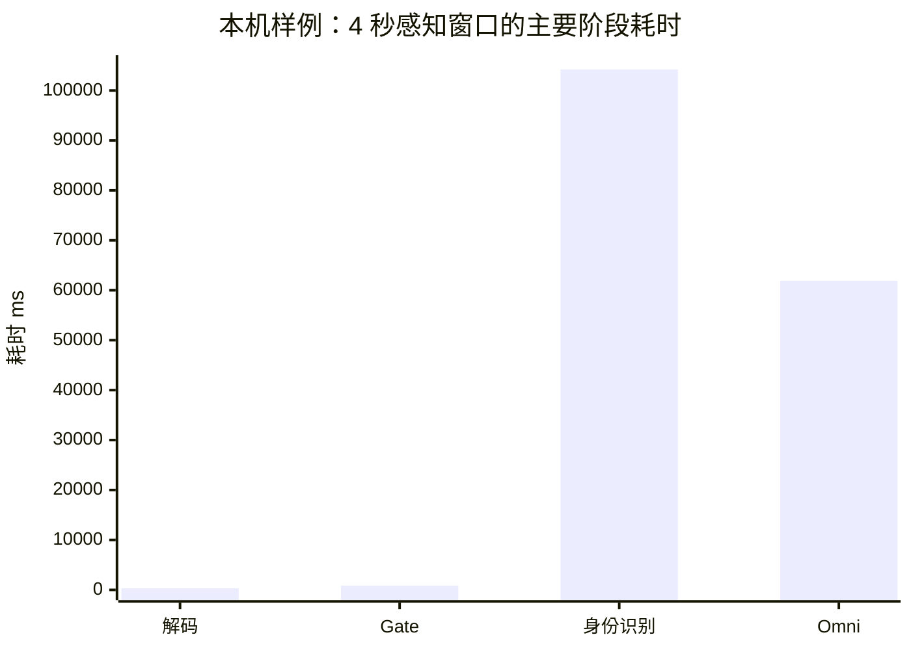
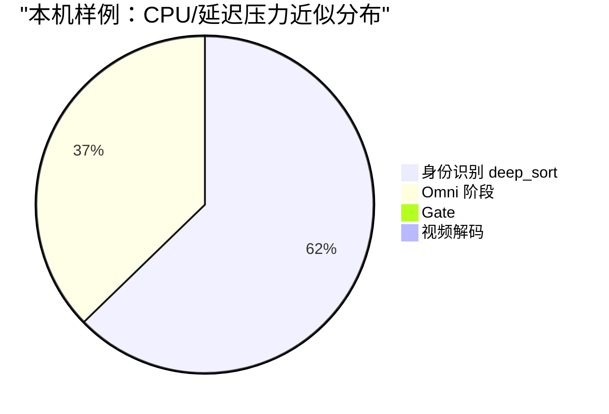
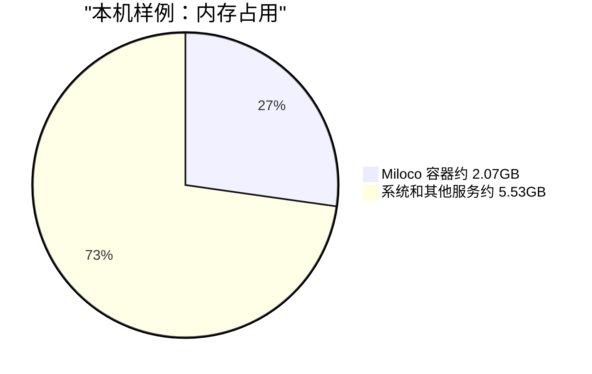

# Miloco 资源占用分析报告

本文说明 Miloco 运行期间可能占用宿主机哪些资源，以及一次 NAS 实机观测到的资源分布。这里的数据只代表本机样例，不能直接当作所有设备的固定结论；不同 CPU、内存、摄像头数量、分辨率、模型服务、网络和配置都会改变结果。

## 结论摘要

Miloco 的宿主机资源压力主要来自四类工作：

| 模块 | 主要资源 | 说明 |
| --- | --- | --- |
| 摄像头拉流和解码 | CPU、网络、少量内存 | 从摄像头取流、解码帧、维护缓存。分辨率越高、摄像头越多，压力越大。 |
| 身份识别 | CPU、内存 | 本地做人/人体检测、跟踪、ReID 等。`deep_sort` 比 `real` 更重。 |
| Omni 调用前处理 | CPU、网络、磁盘临时 IO | 抽帧、缩放、编码 mp4/图片、拼 prompt。模型推理在云端，但本地仍要准备请求。 |
| 日志、数据库和 Web 服务 | 内存、磁盘、少量 CPU | Web 面板、OpenClaw 网关、SQLite、trace、日志和后台任务。 |

如果宿主机 CPU 爆满，优先看身份识别和实时感知帧率；如果响应慢但 CPU 不高，优先看 Omni API、网络上传、模型服务排队和外部 LLM 延迟。

## 本机样例

样例环境：一台家用 x86_64 NAS，Docker 部署 Miloco，接入 3 台米家摄像头，其中有摄像头支持高于 1080P 的分辨率。样例采样时间为 2026-07-02，配置为实时感知开启、`fps=3`、`omni_fps=1`、身份识别模式为 `deep_sort`。

样例观测值：

| 指标 | 样例值 | 含义 |
| --- | ---: | --- |
| Miloco 进程 CPU | 约 244.9% | 多核累计 CPU 百分比，说明进程正在使用多个 CPU 核心。 |
| Miloco RSS 内存 | 约 1.94 GB | 进程常驻内存。 |
| 容器口径内存 | 约 2.07 GB | NAS Docker 面板看到的容器内存占用。 |
| NAS 总内存 | 约 7.6 GB | 本机样例总内存。 |
| 4 秒窗口总处理耗时 | 约 115.9 秒 | 处理 4 秒画面需要约 116 秒，说明实时链路严重积压。 |
| 解码耗时 | 约 0.32 秒 | 本轮样例中解码不是主瓶颈。 |
| Gate 耗时 | 约 0.85 秒 | 判断画面/音频是否值得继续处理。 |
| 身份识别耗时 | 约 104.2 秒 | 本轮样例最大 CPU 压力来源。 |
| Omni 阶段耗时 | 约 61.9 秒 | 主要是请求准备、上传、云端排队/推理和等待响应的墙钟时间。 |

### CPU 压力分布

下面按主要阶段耗时近似展示压力来源。它不是严格 CPU profiler，但能说明哪个阶段拖慢整条链路。





解读：

- `identity_ms` 很高时，说明本地身份识别链路压力大，通常会真实消耗 CPU。
- `omni_ms` 很高时，不代表云端模型在 NAS 上运行；它主要表示请求准备、上传、云端排队、模型推理和等待响应的总耗时。它会拖慢流水线，导致窗口积压。
- `decode_ms` 很低时，说明当前瓶颈不是视频解码；但换成更多摄像头、更高分辨率或实时预览转码时，解码/编码仍可能成为瓶颈。

### RAM 占用

本机样例中，Miloco 容器占用约 2 GB 内存，约占 7.6 GB 总内存的 25% 到 27%。



内存主要来自：

- Python 后端进程、Web 服务和 OpenClaw 相关进程。
- 摄像头帧缓存、解码帧、感知窗口缓存。
- 身份识别模型、跟踪状态、临时 crop 和身份库。
- SQLite、trace、日志写入缓冲和运行时依赖。

内存占用通常比 CPU 更平稳；如果接入更多摄像头、打开实时预览、保留更多日志或身份库增长，内存会继续上升。

## 高分辨率摄像头的影响

高于 1080P 的摄像头不会等于“云端模型直接处理 3K 原片”。Miloco 当前链路里有几处降采样：

- 感知输入会按配置抽帧，例如 `fps=3`。
- 送给 Omni 的视频会缩放到较小尺寸，例如短边约 512。
- Gate 和身份识别内部也有自己的 resize / crop 策略。

但高分辨率仍会影响宿主机：

- 拉流带宽更高。
- 解码原始帧更重。
- 浏览器实时预览如果需要本地转 H.264，可能按原始帧尺寸编码，3K 源流会显著增加 CPU。
- 身份识别虽然会 resize，但摄像头越多、帧越多，检测和跟踪总量仍会上升。

## 如何降低资源占用

NAS 或低功耗主机优先使用保守配置：

```yaml
MILOCO_PERCEPTION__ENGINE__INPUT__FPS: "1"
MILOCO_PERCEPTION__ENGINE__INPUT__OMNI_FPS: "1"
MILOCO_PERCEPTION__ENGINE__IDENTITY__TRACKING_SERVICE_MODE: "real"
```

含义：

- `FPS=1`：每秒只处理 1 帧，直接降低身份识别和 Gate 压力。
- `OMNI_FPS=1`：送给云端模型的视频保持低帧率，避免上传和模型等待扩大。
- `TRACKING_SERVICE_MODE=real`：使用较轻的 SORT 跟踪，降低 `deep_sort` 的 ReID 压力；代价是陌生人去重和跨窗口稳定性弱一些。

如果摄像头支持多档清晰度，也可以把高分辨率摄像头改为低画质拉流。当前运行目录支持 `camera_video_quality_overrides.json`，按摄像头 did 设置 `LOW` 或 `HIGH`。这主要降低拉流、解码和实时预览压力；对本机样例中的 `deep_sort` CPU 瓶颈只能辅助缓解。

## 判断方法

排查时优先看这几个指标：

| 指标 | 判断 |
| --- | --- |
| `cpu_pct` 很高 | 宿主机正在真实消耗 CPU，优先查身份识别、预览转码、解码。 |
| `identity_ms` 很高 | 本地身份识别过重，优先降 `fps` 或从 `deep_sort` 切到 `real`。 |
| `omni_ms` 很高 | 云端 API 或上传/等待慢，优先查网络、模型服务、调用频率。 |
| `decode_ms` 很高 | 视频解码压力大，优先降摄像头清晰度、减少摄像头数量。 |
| `rss_mb` 持续增长 | 关注帧缓存、日志、trace、身份库和潜在泄漏。 |
| 4 秒窗口处理超过 4 秒 | 已不能实时处理；超过数十秒时会明显积压。 |

可用接口或 CLI 查看：

```bash
miloco-cli monitor resources --pretty
miloco-cli monitor status --pretty
```

也可以通过 Web/API 查看 `/api/monitor/resources`、`/api/monitor/nodes`、`/api/perception/engine/status`。

## 使用边界

本报告里的数值来自一台具体 NAS 的一次高负载样例，只能用来解释资源构成和瓶颈判断方法。其他设备可能出现完全不同的分布：

- 更强 CPU：身份识别耗时会下降。
- 更弱 CPU：同样配置可能更快积压。
- 更快模型 API：`omni_ms` 会下降。
- 更多摄像头或更高分辨率：解码、转码、身份识别和网络压力都会上升。
- 不打开实时预览：浏览器转码压力可能不存在。
- 关闭实时感知：CPU 会明显下降，但持续感知能力也会下降。
