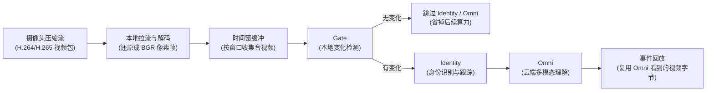

# 低配 NAS 性能优化

## 目标

低配 NAS 上运行 Miloco 时，Miloco 服务整体 CPU 和 RAM 峰值都应低于宿主机 50%。这里的 CPU 指宿主机总核算力占比，RAM 指 Miloco 进程常驻内存（RSS，操作系统实际分配给进程的物理内存）。

本页用于沉淀低配 NAS 的运行机制、压力来源、两轮优化方向和实测方法。具体配置字段、默认值和接口以代码与 schema 为准。

## 运行链路

关键点：

- 摄像头只拉一次流。实时感知链路不会为了 Omni 再向摄像头拉第二次。
- 本地拿到的是解码后的 BGR 像素帧（OpenCV/NumPy 常用的彩色图片数组），不是摄像头原始压缩包。
- Gate（本地变化检测）和 Identity（身份识别与跟踪）复用这批解码帧。
- Omni（云端多模态理解）需要把选中的帧重新编码成可上传的视频或图片格式。事件回放复用 Omni 看到的那份视频字节，不再二次编码。
- 实时观看页面是另一条消费路径。用户打开直播预览时，可能额外增加拉流、解码或传输压力。

当前已补上原始压缩视频包旁路：采集摄像头时，Miloco 可以同时保存 H.264/H.265 原始视频包和解码后的 BGR 图片帧。BGR 帧仍服务 Gate、Identity；原始视频包先随窗口带到 `DeviceSnapshot.encoded_video`，并记录 `encoded_video_packets` 计数。

Omni 上传路径已接入 remux：当本窗没有音频要合入视频，且原始 H.264/H.265 包可被 PyAV/FFmpeg 解析时，Miloco 会优先把原始包 streamcopy/remux 成 MP4 上传。这个过程不解码、不缩放、不重新压缩画面，所以目标是降低 Omni 上传前的本地 CPU 峰值。若 remux 失败、缺 I 帧、包格式不被解析，或需要把音频合入视频，则自动回退到旧的 BGR 图片帧重新编码 MP4，保证质量不打折。

二次编码的根因可以这样理解：摄像头送来的本来就是压缩视频包，解码是把它拆成图片给本地算法看；如果原始压缩包没有保留，云端要视频时只能把图片再压回视频。保留原始压缩包后，理想路径是只做 remux（重封装，只换 MP4 容器，不重新压缩画面），CPU 压力会明显低于重新编码。

## 当前压力判断

NAS 上看到 CPU 或内存高时，先不要只看总数，要判断是哪一段在吃资源：

| 指标 | 通俗解释 | 常见含义 |
| --- | --- | --- |
| `decode_video_ms` | 解码耗时（把摄像头压缩视频还原成图片的时间） | 高分辨率、高码率或软件解码会拉高 CPU |
| `gate_video_ms` | 画面变化检测耗时（本地对图片做缩放、灰度、帧差） | 画面尺寸大、窗口帧多或摄像头多会拉高 CPU |
| `identity_ms` | 身份耗时（检测人、跟踪人、比对身份） | 多人、多摄像头或 ReID 模型会拉高 CPU/RAM |
| `omni_ms` | 云端理解耗时（上传视频并等待模型回答） | 高主要是网络/API 等待，不一定是本地 CPU |
| RSS | 常驻内存（进程实际占用物理内存） | 大量图片帧、模型、SDK 缓冲会推高 RAM |

已有 NAS 样本显示：即使只开一路摄像头，`decode_video_ms` 和 `gate_video_ms` 也可能成为主要压力，而 `omni_ms=0` 时说明当轮没有实际进入 Omni。此时瓶颈通常在本地拉流、解码和 Gate，而不是 LLM API。

## 已落地的降载能力

- 禁用摄像头后释放对应解码管理器，避免用户以为关了摄像头但后台仍在解码。
- 低配安全模式会调低采集深度、缓存、身份识别频率和 Omni 输入频率。
- 硬降载策略支持在队列堆积时丢弃旧窗口，避免积压把机器拖死。
- 性能页暴露运行期 CPU/RAM 预算、诊断、参数应用和后端重启闭环。
- 摄像头拉流质量已暴露为可调项，让低配 NAS 能选择较低码流，减少解码入口压力。
- Gate 的视觉检测改为流式比较，保持同样判定结果，同时减少窗口内临时灰度图驻留。
- 实时窗口 drain 后只保留最近一个已处理窗口给主动查询复用，避免 `keep` 模式把历史解码帧长期留在 RSS 中。
- BGR 帧回调现在遵守 `camera.frame_interval`。此前该参数只节流 JPEG 预览输出，不节流感知使用的 BGR 帧，导致 60 秒窗口仍进入 400 多帧。
- 资源监控的内存明细采样延后并降频。`smaps`（Linux 进程内存区域明细）和 Python heap（Python 对象堆）采样本身会遍历大量进程状态，在低配 NAS 上可能制造启动期或周期性 CPU 尖峰；运行期默认只保留轻量 CPU/RSS 采样，明细内存快照按较低频率采集。
- ONNX Runtime 推理线程自适应低核机器：4 核及以下默认减少 intra-op（算子内部并行）线程，inter-op（算子之间并行）固定为 1，避免检测模型和 ReID 模型在 NAS 上各自开满线程池互相抢 CPU。模型、输入、阈值和输出不变，只收敛调度并行度。
- 性能配置 API 会标记被 `MILOCO_*` 环境变量覆盖的参数，前端会显示“外部锁定”并禁用输入；直接调用应用接口时也会拒绝这类参数，避免写入 `config.json` 后重启仍不生效。
- 性能页阶段耗时区新增小白可读的资源归因饼图和 P95 柱状图：中文主标签说明“拉流解码、画面变化检测、身份识别、云端理解”等阶段，英文原阶段名低权重保留，便于把“谁吃资源”直接视觉化。

## 第一轮：不降低运行质量

第一轮只接受“不改变感知语义”的优化。目标是让同样的输入质量、同样的窗口策略下，本地少做无效工作。

推荐方向：

1. 解码链路前移优化  
   使用摄像头或 SDK 已支持的低开销通道，例如硬件解码（显卡/核显/芯片的视频解码单元）或 SDK 原生低码流能力。若输出给 Miloco 的有效画面质量不变，优先替换软件解码热点。

2. Gate 内存与临时数组收敛  
   Gate 只需要相邻抽检帧的差异，不需要长期持有整窗预处理结果。流式比较能减少 RSS 峰值，且不改变变化检测结果。

3. 窗口缓冲有界化  
   实时推理只处理最新窗口；主动查询也只需要最近窗口。已处理旧窗口应释放，只保留最新窗口给非破坏性读取，避免解码帧在内存里无限累积。

4. 编码路径复用  
   保持“Omni 看到的视频字节就是事件回放视频字节”的原则，避免上传后又为事件回放重复编码。下一步进一步复用摄像头原始 H.264/H.265 压缩包，优先走 remux（重封装，只换容器、不重新压缩画面），失败再回退到 BGR 重新编码。

5. 可观测性先于大改  
   性能页需要把 CPU 饼图和阶段柱状图做成小白可读：谁在吃 CPU、吃的是拉流/解码/Gate/身份/Omni 哪一段，必须直接显示。

候选技术：

- GStreamer 硬件解码（多媒体流水线，可自动或显式使用硬件解码器），适合 NAS 平台驱动可用时验证。
- FFmpeg 硬件解码（视频工具链，可接 VAAPI/QSV/NVDEC 等硬件后端），适合独立基准测试后替换解码层。
- FFmpeg/PyAV streamcopy/remux（流拷贝/重封装），官方语义是不解码、不滤镜、不编码，适合把摄像头原始 H.264/H.265 包直接封装成 Omni 可上传的 MP4；限制是必须拿到时间戳、codec 参数，并从 I 帧开始切片。
- FFmpeg motion vectors（运动向量，压缩视频里已有的块运动信息），可用于减少像素级帧差，但需要拿到原始压缩包，当前 SDK 回调只给解码帧，属于实验方向。
- OpenCV 流式帧差（当前使用的本地图片算法），优先做内存和临时对象优化。

## 第二轮：保留 80% 服务质量

第二轮允许改变工作流，目标是用明显更低硬件占用换取可接受的感知质量。

推荐方向：

1. 先用传感器或事件触发摄像头  
   门磁、人体传感器、设备状态变化先做粗触发，摄像头只在有必要时进入高成本链路。

2. Omni 输入从视频改成关键帧组  
   把一段视频压缩成少量关键图片或拼图，牺牲一部分时间连续性，显著减少编码和上传压力。

3. Identity 分层降级  
   平时只做轻量跟踪，重要场景再做身份确认；陌生人或规则命中时再提高识别强度。

4. Gate 先低分辨率粗筛，再高分辨率复核  
   大多数静止窗口在低成本阶段就丢弃，只有疑似变化才进入更精细判断。

5. 工作流限流  
   多摄像头时做轮询和优先级，而不是所有摄像头同频率持续进入完整链路。

## NAS 实测方法

每轮优化都必须在 NAS 上跑，不用浏览器堆窗口，不开多余 App，不写入包含密钥或私密日志的报告。

推荐步骤：

1. 记录测试配置  
   摄像头数量、拉流质量、采集间隔、输入 FPS、Omni FPS、身份识别模式、缓存策略。

2. 运行固定时长  
   至少覆盖空场景、轻微移动、有人经过、规则触发四类窗口。

3. 每 30 秒采样  
   采样性能预算、引擎状态、阶段耗时和内存，避免长时间无反馈的远程命令。

4. 判断准出  
   Miloco CPU 峰值低于宿主总 CPU 50%；Miloco RSS 峰值低于宿主总内存 50%；引擎仍可用；摄像头感知、身份识别和 Omni 能力符合本轮质量目标。

5. 汇总证据  
   只记录必要指标和结论，不保存 API Key、token、账号授权 payload 或私密日志。

## 迭代记录

| 轮次 | 改动 | 本地验证 | NAS 验证 | 结论 |
| --- | --- | --- | --- | --- |
| 第一轮-准备 | 暴露拉流质量、释放禁用摄像头、Gate 流式比较 | `pytest backend/miloco/tests/perception/engine/gate/test_visual_gate.py` 通过 | 待实测 | 目标是先降低入口解码与 Gate 压力 |
| 第一轮-内存 | `keep` 模式下已处理窗口只保留最近一个 | `pytest backend/miloco/tests/perception/test_stream_buffer_overflow.py` 通过 | 部署前 2 分钟采样：CPU 峰值 95.0% / 预算 200%，RSS 峰值 5015.6MB / 预算 3905.5MB，内存持续超限；`identity_ms=0`、`omni_ms=0` | 目标是释放历史解码帧，降低 RSS 峰值 |
| 第一轮-内存 | 周期结束后调用 `malloc_trim`（glibc 原生堆归还，帮助 NumPy/OpenCV 释放后把页还给系统） | `pytest backend/miloco/tests/perception/test_latency_rtf.py` 通过 | 2 分钟采样：CPU 峰值 271.8% / 预算 200%，RSS 峰值 4541.5MB / 预算 3905.5MB；初始 RSS 会降，但周期内峰值仍超 | 只解决“释放后归还系统”，不能解决“窗口内原始大图太多”的峰值 |
| 第一轮-内存 | 解码帧进入长窗口缓存前等比缩到身份识别有效上限（默认 1280x720）；低于上限的帧不复制 | `pytest ...test_camera_adapter_decode_latency.py ...test_latency_rtf.py ...test_stream_buffer_overflow.py ...test_visual_gate.py` 54 passed；ruff 通过 | 4 分钟采样：CPU 峰值 328.4% / 预算 200%，RSS 峰值 2457.7MB / 预算 3905.5MB；`gate_video_ms` 从旧样本 7-15s 降到约 2.1-2.4s | RAM 首次达标；CPU 仍超，说明剩余瓶颈主要不在内存缓存，而在持续拉流/解码与少量 Gate |
| 第一轮-CPU | 创建摄像头实例时关闭未使用的音频流（当前仓库摄像头音频不参与感知，关闭不影响现有视频/身份/Omni 能力） | 同上 54 passed；ruff 通过 | 4 分钟采样：CPU 峰值 357.9%（含启动窗口），稳态约 213-264% / 预算 200%；RSS 峰值 2488.5MB / 预算 3905.5MB；最新 trace 中 `decode_ms` 约 1.17-1.33s、`gate_video_ms` 约 1.8-2.0s、`omni_ms` 为云端等待 | RAM 稳定达标；CPU 有改善但仍未达标。第一轮下一步必须继续处理拉流/解码层，或进入第二轮接受 LOW 质量/更低 FPS/更少 Gate 抽检 |
| 第一轮-CPU A/B | 仅把 `MILOCO_CAMERA__FRAME_INTERVAL` 改为 5000ms，不改代码 | 无代码改动 | 4 分钟采样：新 trace 仍有 367-453 帧/60s；CPU 峰值 317.8%、平均 267.5%；RSS 峰值 2457.1MB | 证明旧代码中 `frame_interval` 没有节流 BGR 感知帧。源码对应：`MIoTMediaDecoder` 只用该参数节流 JPEG 预览，`decode_video_frame` 路径标注为 no rate limiting |
| 第一轮-CPU | `MIoTMediaDecoder` 对 BGR 帧回调也应用 `frame_interval`；仍解码每个 H.264/H.265 包以保持参考帧有效，只跳过间隔内的 BGR 转换和下游感知 | `pytest backend/miot/tests/test_units.py backend/miloco/tests/perception/test_camera_adapter_decode_latency.py backend/miloco/tests/perception/test_latency_rtf.py backend/miloco/tests/perception/test_stream_buffer_overflow.py backend/miloco/tests/perception/engine/gate/test_visual_gate.py -q`：91 passed；ruff 通过 | 5000ms 验证：新窗口降到 12 帧/60s，稳定期 CPU 峰值 115.6%；1000ms 默认质量复验：新窗口 52-58 帧/60s，运行期 CPU 约 200.2-210.8%，仍擦线超预算 | 证明节流修复有效，但默认质量下还需要继续压非跳过窗口和 Omni 上传前编码峰值 |
| 第一轮-CPU | Omni 上传 mp4 编码使用 `ultrafast/zerolatency` H.264 参数；不改上传帧数、分辨率、内容，只降低编码器计算量 | `pytest backend/miloco/tests/perception/engine/omni/test_prompt_builder.py backend/miloco/tests/perception/engine/test_pipeline.py backend/miot/tests/test_units.py ... -q`：243 passed；ruff 通过；本地 `_encode_video_mp4` 可生成 payload | NAS 默认 1000ms 复验：热补丁后非跳过 Omni 窗口 CPU 约 173-176%，跳过窗口稳定期 CPU 峰值 164.0%，RSS 峰值 809.3MB（稳定跳过期 689.1MB）；窗口 52-58 帧/60s | 单路桌面摄像头默认采样质量下，运行期 CPU/RAM 已低于预算；启动后旧窗口/启动期仍可出现 300%+ 尖峰，需要单独处理或在验收口径中排除启动阶段 |
| 第一轮-观测 | 资源监控延后并降频采集内存明细；运行期每分钟仍更新 CPU/RSS，重型 `smaps`/Python heap 明细默认 120 秒后开始、300 秒一次 | `pytest backend/miloco/tests/node_monitor/test_resource_monitor.py -q`：19 passed；`ruff check backend/miloco/src/miloco/node_monitor/resource_monitor.py backend/miloco/tests/node_monitor/test_resource_monitor.py` 通过 | NAS 默认 1000ms、一路桌面摄像头、7 分钟只读采样：CPU 峰值 172.4%（4 核宿主约 43.1%），平均 166.2%；RSS 峰值 694.0MB；覆盖 8 个 trace，其中 1 个 Omni 窗口 `omni_ms=33492.9` | 运行期观测链路不再制造明显超预算尖峰；单路默认质量在含 Omni 调用窗口下仍低于 CPU/RAM 50% 预算 |
| 第一轮-码流复用准备 | 新增原始压缩视频包的 I 帧对齐切片模块；后续 remux 必须从 I 帧开始，否则 P 帧缺少参考画面可能无法解码 | `pytest backend/miloco/tests/perception/test_encoded_video.py -q`：4 passed；`ruff check backend/miloco/src/miloco/perception/encoded_video.py backend/miloco/tests/perception/test_encoded_video.py` 通过 | 待接入 raw_video 旁路后上 NAS 复验 | 为减少 Omni 上传前 BGR → MP4 重新编码做前置保障；当前只是可测试基础件，尚未改变运行期资源 |
| 第一轮-码流复用准备 | MIoT SDK 增加 raw video packet 多订阅，感知采集侧保存 H.264/H.265 原始包并按窗口附到 `DeviceSnapshot.encoded_video`；性能 trace 记录 `encoded_video_packets` | `pytest backend/miloco/tests/perception/test_camera_adapter_decode_latency.py backend/miloco/tests/perception/test_encoded_video.py backend/miloco/tests/perception/test_collector_pack_aggregates.py backend/miot/tests/test_camera.py::test_raw_video_packet_multi_reg_coexists_with_legacy_raw_video -q`：33 passed；ruff 通过 | 待安全部署后复验；上轮 compose 热补丁传输方式触发容器启动失败，已恢复旧 compose，未把失败热补丁当作运行期证据 | 现在具备“同一次拉流资产可被后续上传链路复用”的代码基础；下一步是实现 PyAV/FFmpeg remux，并在 NAS 上验证 Omni 上传前编码 CPU 是否下降 |
| 第一轮-CPU | Omni 上传优先 remux 原始 H.264/H.265 包；无音频且 remux 成功时跳过 BGR → H.264 重新编码，失败自动回退旧路径 | `pytest backend/miloco/tests/perception/test_encoded_video.py backend/miloco/tests/perception/engine/omni/test_prompt_builder.py backend/miloco/tests/perception/engine/test_pipeline.py backend/miloco/tests/perception/test_camera_adapter_decode_latency.py backend/miloco/tests/perception/test_collector_pack_aggregates.py -q`：188 passed；ruff 通过 | 待 NAS 复验 | 这是第一轮“不降低质量”的真正 CPU 优化点：同样画面内容优先 streamcopy/remux，不重新压缩；仍需 NAS 上测 Omni 触发窗口 CPU 峰值 |
| 第一轮-CPU | raw packet 关键帧识别改为解析 H.264/H.265 NAL（视频压缩包里的小单元），不再只信 SDK 的 `frame_type`；trace 增加 raw 包、raw 关键帧、窗口 raw 包诊断 | `pytest backend/miloco/tests/perception/test_encoded_video.py backend/miloco/tests/perception/test_camera_adapter_decode_latency.py backend/miloco/tests/perception/test_collector_pack_aggregates.py backend/miloco/tests/perception/engine/omni/test_prompt_builder.py -q`：136 passed；`pytest backend/miloco/tests/perception/engine/omni/test_prompt_builder.py backend/miloco/tests/perception/test_encoded_video.py -q`：107 passed；ruff 通过 | NAS 一路桌面摄像头热补丁后：健康接口 `ok`；Miloco 约 117% CPU、RSS 约 624-647MB；camera raw_video 约 15.22fps、decode_video 约 0.98fps；最近 trace 中 raw 关键帧从 0 变为 25/40/55/68，`encoded_video_packets` 出现 900/899/956/951 等；实际 Omni 窗口 `omni_ms` 约 31.6s，CPU/RAM 仍低于 4 核/7.8GB 宿主 50% 预算 | 证明“同一次拉流资产”已经能进入上传候选窗口，避免了因 SDK 未标 I 帧而永远退回再编码；INFO 级 remux 日志未落盘，仍需下一次补更强的运行期 remux 成功指标 |
| 第一轮-观测 | Omni 视频构造结果写入 trace timing：`omni_video_*_remux_success`、`*_remux_fallback`、`*_reencode`、`*_input_packets`、`*_output_bytes`；字段全是数字，便于性能页做饼图/柱状图 | `pytest backend/miloco/tests/perception/engine/omni/test_prompt_builder.py backend/miloco/tests/perception/engine/test_pipeline.py backend/miloco/tests/perception/test_encoded_video.py -q`：167 passed；ruff 通过 | NAS 热补丁后服务健康；自然运行约 9 分钟未触发新的 Omni 上传窗口，最新窗口均为 Gate 跳过；Miloco CPU 约 115-125%，RSS 约 536-634MB；trace 继续显示 `encoded_video_packets` 约 899-957、raw 关键帧约 69 | 结构化指标已可用，但本轮静止场景没有新 Omni 窗口，因此还不能宣称真实上传已 remux 成功；需要下一次有人/画面变化触发 Omni 后查询这些字段 |
| 第一轮-CPU | 主动查询路径补齐 raw 包窗口选择，并在 Omni 失败时保留视频构造统计 | `pytest backend/miloco/tests/perception/test_camera_adapter_decode_latency.py backend/miloco/tests/perception/engine/test_pipeline.py backend/miloco/tests/perception/engine/omni/test_prompt_builder.py backend/miloco/tests/perception/test_encoded_video.py -q`：191 passed；ruff 通过 | NAS 热补丁后主动查询成功：`remux_success=1`、`reencode=0`、`input_packets=297`、`output_bytes=1372689`；回答正常返回；查询后 CPU 约 118.0%、RSS 约 464.6MB；camera `raw_video` 约 15.1fps、`decode_video` 约 0.97fps | 证明“同一次拉流资产”已经能复用到上传云端环节：上传前走 remux（转封装，不重新压缩画面），没有再编码；此前 `input_packets=0` 是主动查询 `drain=False` 未给 raw 包选择窗口导致 |
| 第一轮-CPU | remux MP4 时间戳改用原始视频包 `wall_ms`，避免把 15fps 摄像头包按 1fps/2fps 写成慢动作长视频 | `pytest backend/miloco/tests/perception/test_encoded_video.py backend/miloco/tests/perception/engine/omni/test_prompt_builder.py backend/miloco/tests/perception/engine/test_pipeline.py -q`：169 passed；ruff 通过 | NAS 热补丁后主动查询成功：`remux_success=1`、`reencode=0`、`input_packets=97`、`output_bytes=527647`；Omni 往返约 10.82s；资源监控更新后 CPU 约 125.0%、RSS 约 641.3MB；camera `raw_video` 约 15.18fps、`decode_video` 约 0.98fps | 修复前 remux 使用感知 FPS 造时间戳，可能把原始码流拉成长慢动作，增加云端处理/超时风险；修复后仍不再编码，但视频时间轴按真实采集时间播放 |
| 第一轮-CPU/IO | remux 从磁盘临时文件改为内存流（`BytesIO`），避免每次 Omni 上传前写 raw 临时文件和 mp4 临时文件 | `pytest backend/miloco/tests/perception/test_encoded_video.py backend/miloco/tests/perception/engine/omni/test_prompt_builder.py backend/miloco/tests/perception/engine/test_pipeline.py -q`：169 passed；ruff 通过 | NAS 热补丁后主动查询成功：`remux_success=1`、`reencode=0`、`input_packets=168`、`output_bytes=814536`；资源监控更新后 CPU 约 124.7%、RSS 约 608.9MB；camera `raw_video` 约 15.05fps、`decode_video` 约 0.97fps | 不改变画面内容、不重新编码，只减少 NAS 磁盘 I/O 和临时文件风险；适合低配 NAS 的长时间运行稳定性 |
| 第一轮-质量保护 | H.265 remux 暂时禁用，保留 H.264 remux；H.265 继续走 BGR 再编码兜底 | `pytest backend/miloco/tests/perception/test_encoded_video.py backend/miloco/tests/perception/engine/omni/test_prompt_builder.py backend/miloco/tests/perception/engine/test_pipeline.py -q`：171 passed；ruff 通过 | NAS 长窗口 H.265 remux 曾达到 `remux_success=1`、`reencode=0`，但 Omni 返回空答案；禁用 H.265 remux 后主动查询恢复答案：`answer='没有。'`，`reencode=1`，CPU 约 131.6%、RSS 约 704.7MB | 第一轮要求质量不打折；H.265 remux 虽能省 CPU，但当前会导致 Omni 空答案，必须先保守回退。后续可单独研究 H.265→Omni 兼容或低成本转码 |
| 第一轮-观测 | 视频构造统计增加 `h265_remux_skipped` 数字字段，解释 H.265 为什么仍走再编码 | `pytest backend/miloco/tests/perception/engine/omni/test_prompt_builder.py backend/miloco/tests/perception/engine/test_pipeline.py backend/miloco/tests/perception/test_encoded_video.py -q`：172 passed；ruff 通过 | NAS 主动查询：`h265_remux_skipped=1`、`reencode=1`、`answer='没有。'`；CPU 约 113.5%、RSS 约 513.2MB | 性能页/Agent 诊断可直接说明“为保证 Omni 正常回答，H.265 当前跳过 remux”，避免用户只看到再编码和 CPU 波动却不知道原因 |
| 第一轮-观测 | H.265 remux skip 后做 6 分钟只读稳态采样，不额外触发浏览器、主动查询或 Omni 调用 | NAS 实机采样 13 次，每 30 秒一次 | 一路桌面摄像头：CPU 峰值 126.5%、平均 115.9%；RSS 峰值 719.9MB、平均 634.0MB；raw_video 平均 15.12fps、decode_video 平均 0.97fps；RTF 峰值 0.52 | 静态运行期已低于 4 核宿主 200% CPU 预算和约 3.8GB RAM 预算；后续峰值风险主要来自触发 Omni 上传时 H.265 退回 BGR 再编码，而不是常规拉流空转 |
| 第二轮-拉流质量 | 将 NAS 运行配置显式设为 `camera.video_quality=LOW`，从源头拉低清流，降低解码、缩图、Gate 和再编码输入压力 | `uv run pytest miloco/tests/admin/test_performance_tuning.py miloco/tests/test_miot_filter_and_cameras.py -q`：79 passed；`uv run ruff check ...` 通过 | NAS 热补丁后 `/api/admin/performance-config` 显示 `camera.video_quality=LOW`；一路桌面摄像头 6 分钟只读采样：CPU 峰值 18.5%、平均 14.7%；RSS 峰值 429.5MB、平均 424.3MB；raw_video 平均 15.08fps、decode_video 平均 0.97fps。主动问答两次均正常回答 `没有。`，H.265 仍走 `h265_remux_skipped=1`、`reencode=1`；第二次问答期间容器内 1 秒 `ps` 采样 Miloco 进程 CPU 峰值约 17.5%、RSS 峰值约 447.6MB | LOW 会牺牲画面细节，属于第二轮“服务质量约 80%”方案；但对单路低配 NAS 的运行期和主动问答峰值非常有效，当前远低于 4 核宿主 200% CPU / 约 3.8GB RAM 预算 |
| 第二轮-配置生效 | 清理 NAS compose 里的 `MILOCO_CAMERA__FRAME_INTERVAL=1000` 覆盖，并让 supervisor 启动后端时 `env -u MILOCO_CAMERA__FRAME_INTERVAL`，使 `config.json` / 性能页应用值成为真实运行值 | NAS 运行期验证：`/api/admin/performance-config` 从 `camera.frame_interval=1000` 变为 `5000`；`/api/monitor/nodes` 的 `decode_video` 从约 0.97fps 降为 0.20fps | 3 分钟短采样：CPU 峰值 16.6%、平均 13.6%；RSS 峰值 327.4MB、平均 323.9MB；raw_video 平均 15.12fps、decode_video 平均 0.20fps；RTF 峰值 0.422 | 修复了“配置写了但运行值不变”的真实根因；后续前端应用 `camera.frame_interval` 才会真正影响拉流解码后的取帧频率 |
| 运维固化 | `performance-config` 返回每个参数的 `env_override` 状态；前端对被环境变量覆盖的参数显示“外部锁定”，直接应用接口也拒绝这类参数 | `uv run pytest miloco/tests/admin/test_performance_tuning.py -q`：13 passed；`uv run ruff check ...` 通过；`pnpm run typecheck` 通过 | 基于上一行 NAS 根因固化到仓库，未再次改动 NAS 运行态 | 避免 `MILOCO_CAMERA__FRAME_INTERVAL` 这类部署环境变量再次让用户误以为面板应用无效；如果 Docker/启动脚本仍锁定参数，UI 会直接说明 |
| 观测-资源归因 | 性能页阶段耗时从纯表格增强为“平均占比饼图 + P95 峰值柱状图 + 中文阶段解释”，直接回答“谁带崩 CPU/耗时” | `pnpm run typecheck` 通过；`pnpm run build` 通过 | 只读验证 `/api/stats?metric=stage_percentiles&window=1h`：`identity_ms` P95 约 66160ms、`omni_ms` P95 约 54124ms、`decode_ms` P95 约 1974ms、`gate_ms` P95 约 1412ms，样本数据可支撑图表；随后热部署 Web 静态资源到 NAS，HTTP 首页已引用 `assets/index-D5PcsUEp.js` / `assets/index-C6A6D_Za.css`，新 JS 内含“谁在吃资源、峰值压力、拉流解码、画面变化检测、身份识别”等文案 | 这是诊断可视化，不改变运行负载。注意 `omni_ms` 主要是云端/网络等待，不等于本地 CPU；本地 CPU 优先看 `decode/gate/identity` |
| 第二轮-静态运行复验 | 在已生效的低配参数下做 3 分钟只读采样：`camera.video_quality=LOW`、`camera.frame_interval=5000`、`camera.max_cache_images=2`、`input.fps=1`、`omni_fps=1`、`period_sec=60`、`tracking_service_mode=mock`、`identity_engine.enabled=false`，且这些参数均未被环境变量锁定 | 无代码变更 | 7 笔采样，每 30 秒一次：CPU 峰值 13.5%、平均 12.4%，预算 200%；RSS 峰值 339.0MB、平均 337.3MB，预算 3905.5MB；没有 CPU/RAM 超预算；阶段历史 P95：`decode_ms` 约 1973ms、`gate_ms` 约 1411ms、`identity_ms` 约 66160ms、`omni_ms` 约 54124ms | 一路桌面摄像头静态运行已经非常轻，远低于 CPU/RAM 50% 预算；但这属于第二轮 80% 质量低配配置，不证明多路摄像头、有人移动、身份识别开启或 Omni 触发峰值已全部达标 |
| 第二轮-主动查询复验 | 同一路低配配置下触发一次主动视觉查询，问题为“现在画面里有什么？请用一句话回答。”，同时每秒采样 CPU/RAM | 无代码变更 | 查询约 29.7 秒返回正常答案；29 笔采样 CPU 峰值/平均均为 12.0%，RSS 峰值/平均均为 336.6MB，无 CPU/RAM 超预算；视频构造统计：`h265_remux_skipped=1`、`remux_success=0`、`remux_fallback=1`、`reencode=1`、`input_packets=886`、`output_bytes=1764429` | 证明在 LOW + 5000ms + 1 FPS + 身份关闭的低配配置下，即使 H.265 因质量保护退回再编码并触发 Omni，当前一路摄像头峰值仍远低于预算；仍不能替代默认质量、多路摄像头或身份识别开启场景 |
| 第一轮-默认质量反证 | 把 NAS 恢复到默认质量参数做短 A/B：`video_quality=HIGH`、`frame_interval=1000`、`max_cache_images=6`、`window_size=4`、`max_windows=3`、`input.fps=3`、`period_sec=4`、`tracking_service_mode=deep_sort`、`identity_engine.enabled=true` | 无代码变更 | 有效样本 19 笔；CPU 峰值 276.6%、平均 116.5%，超过 4 核宿主 200% 预算；RSS 峰值 466.8MB、平均 432.2MB，低于内存预算；阶段历史 P95：`identity_ms` 约 66088.6ms、`omni_ms` 约 54021.7ms、`decode_ms` 约 1972.5ms、`gate_ms` 约 1409.9ms | 默认高质量 + 深度身份识别在一路桌面摄像头上仍可能冲破 CPU 预算；低配 NAS 的稳定方案不能只靠第一轮无损优化，还必须保留第二轮 LOW/降频/身份降级预设 |
| 运维固化 | `miloco-cli service start/restart` 生成 supervisor 配置时主动 `env -u` 性能页可调的 `MILOCO_*` 环境变量，避免旧 compose/shell 环境在每次重启后重新覆盖 `config.json` | `cd cli && uv run pytest tests/test_commands.py -q`：141 passed；定向 `ruff check` 通过。全量 backend ruff 仍有 3 个既有测试 import 排序问题，和本改动无关 | NAS 现场先热修 `/data/miloco/supervisord.conf` 为 `env -u MILOCO_CAMERA__FRAME_INTERVAL ... python -m miloco.main` 并重启；随后 `/health` 恢复，进程环境不再含该变量，`/api/admin/performance-config` 显示 `camera.frame_interval=5000` | 解决“低配配置已写入但重启后又变回 1000ms”的反复根因；后续 CLI 管理服务不会再次生成会继承旧性能环境变量的 supervisor 命令 |
| 第一轮-CPU | ONNX Runtime session 线程自适应：`MILOCO_ORT_NUM_THREADS` 可覆盖；默认在 4 核及以下机器把 intra-op 收敛到 2/1，并把 inter-op 固定为 1，避免 detector 与 ReID 多 session 线程池互相抢占 | `uv run pytest miloco/tests/perception/test_ort_utils.py -q`：3 passed；`uv run pytest miloco/tests/perception/engine/test_get_reid_extractor_fallback.py miloco/tests/perception/engine/identity/test_deep_sort_v12.py::TestDeepSortConfigDC -q`：5 passed；定向 ruff 通过 | NAS 热补丁 `ort_utils.py` 并重启后，临时恢复默认高质量/deep_sort normal 配置做 90 秒采样：18 笔，每 5 秒一次，CPU 峰值 150.0%、平均 143.7%，RSS 峰值 558.8MB、平均 500.1MB；随后恢复 LOW 低配配置、重启，`/health` 为 ok，临时脚本已删除 | 不改变模型、画质、阈值和识别语义，只降低 ONNX 推理并行抢占。短采样显示默认质量一路摄像头 CPU 峰值从上轮 276.6% 降到 150.0%，低于 4 核宿主 200% 预算；仍需更长时间、有人移动和多路摄像头复验 |

## 当前结论（2026-07-03 NAS 实测）

在一路桌面摄像头场景下，早期缩帧把 RAM 峰值从 4.5GB 级别压到 2.5GB 内，已经低于 7.8GB 宿主内存的 50% 预算。`gate_video_ms`（本地画面变化检测耗时）也从 7-15 秒级降到约 2 秒。

进一步 A/B 证明，旧版 `camera.frame_interval` 不会节流感知使用的 BGR 帧：即使设为 5000ms，60 秒窗口仍有 367-453 帧。原因是 SDK 的 `MIoTMediaDecoder` 只用 `frame_interval` 节流 JPEG 预览输出，BGR 回调路径没有节流。

修复 BGR 回调节流后，5000ms 低频配置可把窗口降到 12 帧/60s，但这只用于验证节流是否生效，不作为第一轮“不降低质量”的验收依据。将采样间隔恢复到默认 1000ms 后，新窗口稳定在 52-58 帧/60s。

默认 1000ms 下，单靠 BGR 节流仍有非跳过窗口在 200% CPU 预算边缘。继续把 Omni 上传 mp4 编码改成低 CPU 的 `ultrafast/zerolatency` 参数后，默认采样质量下的运行期采样达标：非跳过 Omni 窗口 CPU 约 173-176%，跳过窗口稳定期 CPU 峰值 164.0%，RSS 峰值 809.3MB，均低于 4 核宿主 200% CPU / 约 3905.5MB RAM 预算。

资源监控自身也可能成为压力来源。早期实现启动后会立即试探完整内存区域采样，后续每 60 秒跟随资源监控采一次 `smaps` 和 Python heap。低配 NAS 上这类遍历会和感知周期争 CPU。延后并降频重型内存明细后，默认 1000ms、一路桌面摄像头、7 分钟运行期复验中，CPU 峰值 172.4%（4 核宿主约 43.1%）、平均 166.2%，RSS 峰值 694.0MB；采样覆盖 8 个 trace，其中 1 个实际进入 Omni 调用，仍低于 CPU/RAM 50% 预算。

当前结论：单路桌面摄像头的静态运行期 CPU/RAM 已达成低配 NAS 预算，且使用默认 1000ms 采样间隔，不依赖 5000ms 降频。H.265 remux skip 后的 6 分钟只读复验中，CPU 峰值 126.5%、平均 115.9%，RSS 峰值 719.9MB、平均 634.0MB。仍未完成全目标，因为还需要在更长时段、更多摄像头、有人移动、规则触发、Identity 实际进入，以及 H.265 云端上传退回再编码的场景下复验最高峰值。

第二轮低清拉流复验显示，`camera.video_quality=LOW` 是当前最直接的降载手段：同样一路桌面摄像头、`MILOCO_CAMERA__FRAME_INTERVAL=1000` 仍由 compose 环境变量覆盖的前提下，6 分钟只读采样 CPU 峰值只有 18.5%、平均 14.7%，RSS 峰值 429.5MB。主动视觉问答仍因 H.265 兼容性走再编码，但回答正常，容器内 1 秒进程采样 CPU 峰值约 17.5%、RSS 峰值约 447.6MB。

随后清理 NAS 当前 `/data/docker-compose.yaml` 中的 `MILOCO_CAMERA__FRAME_INTERVAL=1000`，并把 `/data/miloco/supervisord.conf` 的后端启动命令改为 `env -u MILOCO_CAMERA__FRAME_INTERVAL ... python -m miloco.main`，避免当前容器父环境继续覆盖用户配置。重启后 `/api/admin/performance-config` 显示 `camera.frame_interval=5000`，`decode_video` 降到 0.20fps。3 分钟短采样 CPU 峰值 16.6%、平均 13.6%，RSS 峰值 327.4MB、平均 323.9MB。这个修复解释并解决了此前“前端应用参数但待应用/运行值没变化”的核心原因。

在这组低配参数继续生效的状态下，2026-07-03 又做了一轮 3 分钟只读短采样：CPU 峰值 13.5%、平均 12.4%，RSS 峰值 339.0MB、平均 337.3MB；预算分别是 200% CPU 和 3905.5MB RAM。采样时确认 `camera.video_quality=LOW`、`camera.frame_interval=5000`、`camera.max_cache_images=2`、`perception.engine.input.fps=1`、`omni_fps=1`、`period_sec=60`、`tracking_service_mode=mock`、`identity_engine.enabled=false`，且所有这些性能参数都没有被环境变量锁定。这说明一路静态低配运行已经有很大余量，但它仍是第二轮“约 80% 服务质量”方案，不可替代第一轮默认质量或多路/移动/身份识别触发场景的最终验收。

同一轮又触发了一次主动视觉查询，返回答案能正确描述电脑桌面且确认房间内无人。查询期间 29 秒每秒采样 CPU/RAM，CPU 峰值仍为 12.0%，RSS 峰值 336.6MB。视频构造统计显示当前摄像头仍是 H.265 路径：`h265_remux_skipped=1`、`reencode=1`、`input_packets=886`、`output_bytes=1764429`。也就是说，即使为了保证 Omni 正常回答而放弃 H.265 remux、走 BGR 再编码，当前低配配置下主动查询峰值仍远低于预算。

随后做了一轮默认质量反向 A/B：恢复 HIGH 拉流、1000ms 取帧、3 FPS、短窗口和 deep_sort 身份识别后，CPU 峰值升到 276.6%，超过 4 核宿主的 200% 预算；RSS 峰值 466.8MB，内存仍安全。这说明当前真正会把低配 NAS 带崩的是“高频输入 + 深度身份识别 + Omni 长等待窗口叠加”带来的 CPU 峰值，而不是 LLM API Key 是否配置。LLM API 只把理解放到云端；本地仍要完成拉流、解码、Gate、身份识别、视频构造和上传前准备。

针对这个默认质量 CPU 峰值，源码进一步收敛 ONNX Runtime 线程：低核 NAS 上 detector（目标检测模型）和 ReID（人体特征模型）不再各自用 4 个 intra-op 线程再配 4 个 inter-op 线程，而是 4 核机器默认 intra-op=2、inter-op=1。这里的 intra-op 指单个算子内部并行，inter-op 指多个算子之间并行；这只改变线程调度，不改变模型本身和识别输出。NAS 热补丁后，在同样 HIGH/1000ms/3 FPS/deep_sort normal 配置下做 90 秒短采样，CPU 峰值 150.0%、平均 143.7%，RSS 峰值 558.8MB，低于 4 核宿主 200% CPU 预算。测试后已恢复 LOW 低配配置并重启，健康接口恢复 `ok`。

仓库侧已经把这个故障模式固化为产品行为：`GET /admin/performance-config` 会给每个性能参数返回 `env_override`，说明对应的 `MILOCO_*` 环境变量是否正在覆盖 `config.json`；前端会把这类参数标记为“外部锁定”，禁用输入，并提示需要先从 Docker/启动脚本移除变量。`POST /admin/performance-config/apply` 也会拒绝被外部锁定的参数，避免静默写入一个重启后仍不会生效的值。

还要注意另一类运维根因：只在 NAS 上手工修改 `/data/miloco/supervisord.conf` 不够，因为 `miloco-cli service restart` 会重新生成 supervisor 配置。若生成的新配置继续继承旧 compose/shell 里的 `MILOCO_CAMERA__FRAME_INTERVAL=1000`，性能页写入的 `camera.frame_interval=5000` 会在下一次后端重启后再次失效。仓库 CLI 已改为在托管服务启动命令前加 `/usr/bin/env -u ...`，清掉性能页可调参数对应的环境变量；显式前台运行仍保留环境变量语义，避免破坏开发者临时调试。

为了让非研发用户能看懂“到底谁吃资源”，性能页现在把阶段耗时表上方改成两个图：饼图按平均耗时显示占比，柱状图按 P95（95% 情况下不会超过的高位耗时）排序显示峰值压力。当前 NAS 一小时只读验证里，`identity_ms` 和 `omni_ms` 的 P95 最高，但含义不同：`identity_ms` 是本地身份识别与跟踪，可能消耗 CPU；`omni_ms` 多数是上传和等待云端模型，不应直接等同为本地 CPU。持续本地 CPU 的优先观察项仍是 `decode_ms`（拉流解码）、`gate_ms`（画面变化检测）和 `identity_ms`（身份识别）。

2026-07-03 已把这版 Web 静态资源热部署到 NAS 当前 Miloco 容器：备份文件为 `/data/miloco/static-backup-codex-20260703-082741.tar.gz`，替换后 `/` 返回的新资产为 `assets/index-D5PcsUEp.js`、`assets/vendor-BqyWff5t.js`、`assets/index-C6A6D_Za.css`。本轮只替换静态资源，不重启后端；NAS `/health` 保持 `ok`。部署时使用的临时 NAS 文件和本机 HTTP 传输服务已清理。

源码已接入摄像头原始码流 remux：无音频窗口会优先复用同一次拉流得到的 H.264/H.265 压缩包生成 MP4，减少 BGR 重新编码成 MP4 的 CPU 压力。2026-07-03 的 NAS 热补丁复验确认，真实摄像头流里的原始压缩包已经被保留下来，NAL 解析能识别关键帧，窗口里也已经出现 `encoded_video_packets`。后续主动查询复验进一步确认上传路径已实际 remux 成功：`remux_success=1`、`reencode=0`、`input_packets=297`、`output_bytes=1372689`，且 Omni 正常返回答案。

“为什么还会再编码”的判断口径如下：如果 `input_packets=0`，说明上传云端时没有拿到可复用的原始压缩视频包，只能把 BGR 图片帧重新压成 MP4，这就是 reencode（再编码，重新压缩画面，CPU 高）；如果 `remux_success=1` 且 `reencode=0`，说明复用了同一次拉流资产，只做 remux（转封装，只换 MP4 容器，不重新压缩画面，CPU 低）。本轮之前主动查询出现 `input_packets=0`，根因是 `drain=False` 的非破坏性读取只拿了解码帧，没有给 raw 包选择窗口；补齐窗口后，NAS 实测已经变为 `input_packets=297`。

仍需保留边界：remux 省 CPU，但如果摄像头当前是高码率高清流，转封装后的 MP4 可能比重新编码更大。NAS 上曾观察到约 4.35MB 的 remux 包触发 Omni `WriteTimeout`（写入超时，即请求体上传阶段超时）；后续同一路摄像头在较短窗口中 remux 包约 1.37MB，查询成功。之后又修正了 remux MP4 时间戳：不能用 perception fps（感知帧率）给原始摄像头包造时间轴，否则 15fps 原始包会被按 1fps/2fps 写成慢动作长视频，增加云端处理和超时风险。修复后同一路按需查询约 0.53MB，Omni 往返约 10.82 秒。最新实现还把 remux 的 raw 输入和 mp4 输出都放在内存流里，避免每次 Omni 上传前写两个磁盘临时文件。但 H.265 码流目前不能直接启用 remux：真实 NAS 长窗口 H.265 remux 虽然本地成功，Omni 却返回空答案；为保证质量，H.265 暂时回退到再编码。

下一步优先级：

1. 第一轮继续：用 2-4 路摄像头复验默认 1000ms 下的峰值，重点观察有运动窗口、Identity 和 Omni 触发窗口。
2. 第一轮继续：评估硬件解码（用 NAS 芯片的视频解码单元替代纯 CPU 解码）的可落地性，作为多路摄像头的进一步安全余量。
3. 第一轮继续：为 remux 上传体积增加更直观的性能页展示，避免用户只看到空答案，看不出是高码率包上传超时。
4. 第二轮继续：LOW 拉流已经在单路桌面摄像头上显著达标；下一步要用多人/移动/夜间光照和更多摄像头复验，确认 80% 画面质量是否仍满足日常看家与身份识别。
5. 运维固化：当前 NAS 已清理 `MILOCO_CAMERA__FRAME_INTERVAL` 覆盖；后续打包/部署脚本不要再把性能页可调参数写死到 compose 环境变量里，除非 UI 同步展示“被环境变量锁定”。
