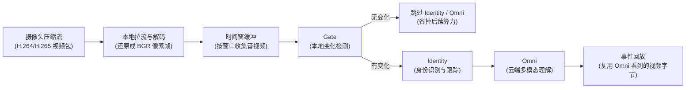

# 低配 NAS 性能优化

## 目标

低配 NAS 上运行 Miloco 时，Miloco 服务整体 CPU 和 RAM 峰值都应低于宿主机 50%。这里的 CPU 指宿主机总核算力占比，RAM 指 Miloco 进程常驻内存（RSS，操作系统实际分配给进程的物理内存）。

本页用于沉淀低配 NAS 的运行机制、压力来源、两轮优化方向和实测方法。具体配置字段、默认值和接口以代码与 schema 为准。

## 运行链路

关键点：

- 摄像头只拉一次流。实时感知链路不会为了 Omni 再向摄像头拉第二次。
- 本地拿到的是解码后的 BGR 像素帧（OpenCV/NumPy 常用的彩色图片数组），不是摄像头原始压缩包。
- Gate（本地变化检测）和 Identity（身份识别与跟踪）复用这批解码帧。
- Omni（云端多模态理解）需要把选中的帧重新编码成可上传的视频或图片格式。事件回放复用 Omni 看到的那份视频字节，不再二次编码。
- 实时观看页面是另一条消费路径。用户打开直播预览时，可能额外增加拉流、解码或传输压力。

## 当前压力判断

NAS 上看到 CPU 或内存高时，先不要只看总数，要判断是哪一段在吃资源：

| 指标 | 通俗解释 | 常见含义 |
| --- | --- | --- |
| `decode_video_ms` | 解码耗时（把摄像头压缩视频还原成图片的时间） | 高分辨率、高码率或软件解码会拉高 CPU |
| `gate_video_ms` | 画面变化检测耗时（本地对图片做缩放、灰度、帧差） | 画面尺寸大、窗口帧多或摄像头多会拉高 CPU |
| `identity_ms` | 身份耗时（检测人、跟踪人、比对身份） | 多人、多摄像头或 ReID 模型会拉高 CPU/RAM |
| `omni_ms` | 云端理解耗时（上传视频并等待模型回答） | 高主要是网络/API 等待，不一定是本地 CPU |
| RSS | 常驻内存（进程实际占用物理内存） | 大量图片帧、模型、SDK 缓冲会推高 RAM |

已有 NAS 样本显示：即使只开一路摄像头，`decode_video_ms` 和 `gate_video_ms` 也可能成为主要压力，而 `omni_ms=0` 时说明当轮没有实际进入 Omni。此时瓶颈通常在本地拉流、解码和 Gate，而不是 LLM API。

## 已落地的降载能力

- 禁用摄像头后释放对应解码管理器，避免用户以为关了摄像头但后台仍在解码。
- 低配安全模式会调低采集深度、缓存、身份识别频率和 Omni 输入频率。
- 硬降载策略支持在队列堆积时丢弃旧窗口，避免积压把机器拖死。
- 性能页暴露运行期 CPU/RAM 预算、诊断、参数应用和后端重启闭环。
- 摄像头拉流质量已暴露为可调项，让低配 NAS 能选择较低码流，减少解码入口压力。
- Gate 的视觉检测改为流式比较，保持同样判定结果，同时减少窗口内临时灰度图驻留。
- 实时窗口 drain 后只保留最近一个已处理窗口给主动查询复用，避免 `keep` 模式把历史解码帧长期留在 RSS 中。

## 第一轮：不降低运行质量

第一轮只接受“不改变感知语义”的优化。目标是让同样的输入质量、同样的窗口策略下，本地少做无效工作。

推荐方向：

1. 解码链路前移优化  
   使用摄像头或 SDK 已支持的低开销通道，例如硬件解码（显卡/核显/芯片的视频解码单元）或 SDK 原生低码流能力。若输出给 Miloco 的有效画面质量不变，优先替换软件解码热点。

2. Gate 内存与临时数组收敛  
   Gate 只需要相邻抽检帧的差异，不需要长期持有整窗预处理结果。流式比较能减少 RSS 峰值，且不改变变化检测结果。

3. 窗口缓冲有界化  
   实时推理只处理最新窗口；主动查询也只需要最近窗口。已处理旧窗口应释放，只保留最新窗口给非破坏性读取，避免解码帧在内存里无限累积。

4. 编码路径复用  
   保持“Omni 看到的视频字节就是事件回放视频字节”的原则，避免上传后又为事件回放重复编码。

5. 可观测性先于大改  
   性能页需要把 CPU 饼图和阶段柱状图做成小白可读：谁在吃 CPU、吃的是拉流/解码/Gate/身份/Omni 哪一段，必须直接显示。

候选技术：

- GStreamer 硬件解码（多媒体流水线，可自动或显式使用硬件解码器），适合 NAS 平台驱动可用时验证。
- FFmpeg 硬件解码（视频工具链，可接 VAAPI/QSV/NVDEC 等硬件后端），适合独立基准测试后替换解码层。
- FFmpeg motion vectors（运动向量，压缩视频里已有的块运动信息），可用于减少像素级帧差，但需要拿到原始压缩包，当前 SDK 回调只给解码帧，属于实验方向。
- OpenCV 流式帧差（当前使用的本地图片算法），优先做内存和临时对象优化。

## 第二轮：保留 80% 服务质量

第二轮允许改变工作流，目标是用明显更低硬件占用换取可接受的感知质量。

推荐方向：

1. 先用传感器或事件触发摄像头  
   门磁、人体传感器、设备状态变化先做粗触发，摄像头只在有必要时进入高成本链路。

2. Omni 输入从视频改成关键帧组  
   把一段视频压缩成少量关键图片或拼图，牺牲一部分时间连续性，显著减少编码和上传压力。

3. Identity 分层降级  
   平时只做轻量跟踪，重要场景再做身份确认；陌生人或规则命中时再提高识别强度。

4. Gate 先低分辨率粗筛，再高分辨率复核  
   大多数静止窗口在低成本阶段就丢弃，只有疑似变化才进入更精细判断。

5. 工作流限流  
   多摄像头时做轮询和优先级，而不是所有摄像头同频率持续进入完整链路。

## NAS 实测方法

每轮优化都必须在 NAS 上跑，不用浏览器堆窗口，不开多余 App，不写入包含密钥或私密日志的报告。

推荐步骤：

1. 记录测试配置  
   摄像头数量、拉流质量、采集间隔、输入 FPS、Omni FPS、身份识别模式、缓存策略。

2. 运行固定时长  
   至少覆盖空场景、轻微移动、有人经过、规则触发四类窗口。

3. 每 30 秒采样  
   采样性能预算、引擎状态、阶段耗时和内存，避免长时间无反馈的远程命令。

4. 判断准出  
   Miloco CPU 峰值低于宿主总 CPU 50%；Miloco RSS 峰值低于宿主总内存 50%；引擎仍可用；摄像头感知、身份识别和 Omni 能力符合本轮质量目标。

5. 汇总证据  
   只记录必要指标和结论，不保存 API Key、token、账号授权 payload 或私密日志。

## 迭代记录

| 轮次 | 改动 | 本地验证 | NAS 验证 | 结论 |
| --- | --- | --- | --- | --- |
| 第一轮-准备 | 暴露拉流质量、释放禁用摄像头、Gate 流式比较 | `pytest backend/miloco/tests/perception/engine/gate/test_visual_gate.py` 通过 | 待实测 | 目标是先降低入口解码与 Gate 压力 |
| 第一轮-内存 | `keep` 模式下已处理窗口只保留最近一个 | `pytest backend/miloco/tests/perception/test_stream_buffer_overflow.py` 通过 | 部署前 2 分钟采样：CPU 峰值 95.0% / 预算 200%，RSS 峰值 5015.6MB / 预算 3905.5MB，内存持续超限；`identity_ms=0`、`omni_ms=0` | 目标是释放历史解码帧，降低 RSS 峰值 |
| 第一轮-内存 | 周期结束后调用 `malloc_trim`（glibc 原生堆归还，帮助 NumPy/OpenCV 释放后把页还给系统） | `pytest backend/miloco/tests/perception/test_latency_rtf.py` 通过 | 2 分钟采样：CPU 峰值 271.8% / 预算 200%，RSS 峰值 4541.5MB / 预算 3905.5MB；初始 RSS 会降，但周期内峰值仍超 | 只解决“释放后归还系统”，不能解决“窗口内原始大图太多”的峰值 |
| 第一轮-内存 | 解码帧进入长窗口缓存前等比缩到身份识别有效上限（默认 1280x720）；低于上限的帧不复制 | `pytest ...test_camera_adapter_decode_latency.py ...test_latency_rtf.py ...test_stream_buffer_overflow.py ...test_visual_gate.py` 54 passed；ruff 通过 | 4 分钟采样：CPU 峰值 328.4% / 预算 200%，RSS 峰值 2457.7MB / 预算 3905.5MB；`gate_video_ms` 从旧样本 7-15s 降到约 2.1-2.4s | RAM 首次达标；CPU 仍超，说明剩余瓶颈主要不在内存缓存，而在持续拉流/解码与少量 Gate |
| 第一轮-CPU | 创建摄像头实例时关闭未使用的音频流（当前仓库摄像头音频不参与感知，关闭不影响现有视频/身份/Omni 能力） | 同上 54 passed；ruff 通过 | 4 分钟采样：CPU 峰值 357.9%（含启动窗口），稳态约 213-264% / 预算 200%；RSS 峰值 2488.5MB / 预算 3905.5MB；最新 trace 中 `decode_ms` 约 1.17-1.33s、`gate_video_ms` 约 1.8-2.0s、`omni_ms` 为云端等待 | RAM 稳定达标；CPU 有改善但仍未达标。第一轮下一步必须继续处理拉流/解码层，或进入第二轮接受 LOW 质量/更低 FPS/更少 Gate 抽检 |

## 当前结论（2026-07-03 NAS 实测）

在一路桌面摄像头场景下，早期缩帧把 RAM 峰值从 4.5GB 级别压到 2.5GB 内，已经低于 7.8GB 宿主内存的 50% 预算。`gate_video_ms`（本地画面变化检测耗时）也从 7-15 秒级降到约 2 秒。

CPU 仍未达标。最新稳定采样仍在 213-264%（四核宿主上约 53%-66% 总 CPU）之间，超过 200% 预算。由于最新 trace 中 `identity_ms` 接近 0、`omni_ms` 是云端等待、`gate_video_ms` 已降到 2 秒以内，剩余 CPU 大头更可能在摄像头 SDK 拉流/解码（把压缩视频还原成图片）这一段。

下一步优先级：

1. 第一轮继续：验证 `frame_interval` 是否真的节流了 SDK 解码，而不只是节流缓存/预览；如果没有，需要在解码回调注册或 SDK 创建实例处找到真正的抽帧入口。
2. 第一轮继续：评估硬件解码（用 NAS 芯片的视频解码单元替代纯 CPU 解码）的可落地性。
3. 第二轮备选：将 `camera.video_quality` 切到 `LOW`、降低输入 FPS 或限制 Gate 抽检帧数。这会牺牲一部分画面细节或瞬时事件敏感度，不属于“质量不打折”方案。
